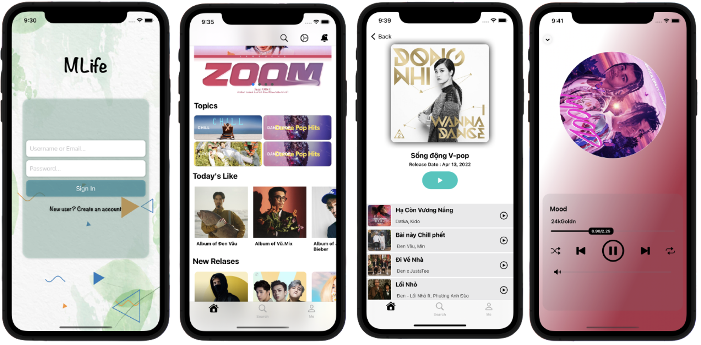

<span></span>
&nbsp;
<span></span>
&nbsp;
<span></span>
&nbsp;
<span></span>
&nbsp;
<span></span>
&nbsp;

<h1 align="center">🔥 MLife IOS 🔥</h1>

A music player app that streams songs online.

## Background
<p align="center">
    
</p>

## Guide

You need to download Cocoapods and add third party APIs to run the app.</br>
Login account with ***test@gmail.com*** and ***12345678***.</br>

***Third party APIs***

```Swift
pod 'Firebase/Core'
pod 'Firebase/Auth'
pod 'Firebase/Database'
pod 'Firebase/Analytics'
pod 'Firebase/Crashlytics'
pod 'Firebase/Storage'

pod 'NotificationBannerSwift', '~> 3.0.0'

# Gemini is rich scroll based animation framework.
pod "Gemini" 

# -> Gradient animation effect like Instagram.
pod 'Pastel', '~> 0.6.0'

pod 'SDWebImage', '~> 5.0'

pod 'lottie-ios'
```

